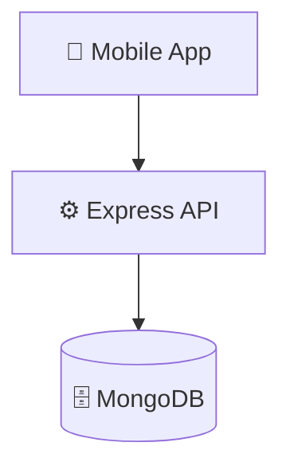

# karen

## 📑 Table of Contents

- [Description](#description)
- [Screenshots](#screenshots)
- [Tech Stack](#tech-stack)
- [Architecture](#architecture)
- [Quick Start](#quick-start)
- [Key Dependencies](#key-dependencies)
- [API Endpoints](#api-endpoints)
- [Project Structure](#project-structure)
- [Development Setup](#development-setup)
- [Contributors](#contributors)
- [Contributing](#contributing)

## 📝 Description

# KAREN – AI Personal Assistant

**KAREN** is an AI-powered personal assistant designed to understand natural-language commands and perform actions directly on an Android device. Instead of simply responding with text, KAREN can **understand a user's intent, generate an action plan, and execute tasks through Android accessibility services**.

The system combines **AI-powered intent recognition with native Android automation**, allowing users to interact with their phone using simple conversational commands such as *“Open YouTube and search for DSA”* or *“Open WhatsApp.”*

### Key Features

* 🤖 **Natural Language Understanding** – Converts everyday user instructions into structured actions.
* ⚡ **AI Action Planning** – Breaks complex commands into a sequence of executable steps.
* 📱 **Android App Automation** – Opens and interacts with installed applications.
* ♿ **Accessibility-Based Control** – Uses Android Accessibility Services to identify UI elements, click buttons, enter text, navigate screens, and perform actions.
* 🎙️ **Voice Interaction** – Supports voice-based commands for hands-free interaction.
* 🔄 **Multi-Step Task Execution** – Executes actions such as opening an app → finding an input field → entering text → pressing enter → selecting a result.
* 🧠 **Context-Aware Execution** – Maintains the action sequence and handles delays between UI operations.
* 💬 **Conversational Interface** – Provides users with feedback about what it is doing.

### Technology Stack

**Frontend:** React Native
**Native Android:** Kotlin
**AI:** LLM-based action planning
**Automation:** Android Accessibility Service
**Communication:** React Native Native Modules
**Platform:** Android

### Example

**User:**

> "Open YouTube and search for dynamic programming."

**KAREN:**

1. Opens YouTube
2. Finds the search input
3. Enters "dynamic programming"
4. Presses Enter
5. Selects the search result

KAREN aims to bridge the gap between **AI conversation and real-world device control**, turning natural-language instructions into actual actions on an Android smartphone.


## 📸 Screenshots


## 🛠️ Tech Stack

-3DDC84?style=for-the-badge&logo=android&logoColor=white)  -ED8B00?style=for-the-badge&logo=openjdk&logoColor=white)     -000000?style=for-the-badge&logo=apple&logoColor=white)

**Notable libraries:** Mongoose, Multer

## 🏗️ Architecture

A high-level view of how the main pieces fit together:



## ⚡ Quick Start

```bash

# 1. Clone the repository
git clone https:\\github.com\sundram1343\karen.git

# 2. Install dependencies
npm install

# 3. Start the dev server
npm run dev
```

## 📦 Key Dependencies

```
bcrypt: ^6.0.0
cors: ^2.8.6
dotenv: ^17.4.2
express: ^5.2.1
groq-sdk: ^1.5.0
jsonwebtoken: ^9.0.3
mongoose: ^9.9.0
multer: ^2.2.0
nodemon: ^3.1.14
open: ^11.0.1
pdf-parse: ^2.4.5
```

## 🌐 API Endpoints

Detected endpoints (best-effort scan):

```
POST /register
POST /login
POST /send
GET /chats
GET /chat/:chatid
```

## 📁 Project Structure

```
.
├── Backend
│   ├── app.js
│   ├── config
│   │   ├── DB.js
│   │   └── groq-config.js
│   ├── controllers
│   │   ├── auth-controller.js
│   │   └── message-controller.js
│   ├── middleware
│   │   ├── authmiddleware.js
│   │   └── uploadmiddleware.js
│   ├── models
│   │   ├── chat-model.js
│   │   ├── message-model.js
│   │   └── user-model.js
│   ├── package.json
│   └── routes
│       ├── auth-router.js
│       └── message-router.js
└── Frontend
    └── Karen
        ├── .bundle
        │   └── config
        ├── Gemfile
        ├── __tests__
        │   └── App.test.tsx
        ├── app.json
        ├── babel.config.js
        ├── env.d.ts
        ├── index.js
        ├── jest.config.js
        ├── metro.config.js
        ├── package.json
        ├── src
        │   ├── App.jsx
        │   ├── AuthScreens
        │   │   ├── Login.jsx
        │   │   └── SignUp.jsx
        │   ├── Components
        │   │   ├── ChatHeader.jsx
        │   │   ├── ChatInput.jsx
        │   │   ├── MessageBubble.jsx
        │   │   ├── NavDrawer.jsx
        │   │   └── TypingIndicator.jsx
        │   ├── Home
        │   │   └── Home.jsx
        │   ├── assets
        │   │   └── LoginScreen.png
        │   └── services
        │       └── actions.jsx
        └── tsconfig.json
```

## 🛠️ Development Setup

### Node.js / JavaScript
1. Install Node.js (v18+ recommended)
2. Install dependencies: `npm install` (or `yarn` / `pnpm install` / `bun install`)
3. Start the dev server: see the **Quick Start** above

## 👥 Contributors

Thanks to everyone who has contributed to this project:

<p align="left">
<a href="https://github.com/sundram1343" title="sundram1343"></a>
</p>

## 👥 Contributing

Contributions are welcome! Here's the standard flow:

1. **Fork** the repository
2. **Clone** your fork: `git clone https:\\github.com\sundram1343\karen.git`
3. **Branch**: `git checkout -b feature/your-feature`
4. **Commit**: `git commit -m 'feat: add some feature'`
5. **Push**: `git push origin feature/your-feature`
6. **Open** a pull request

Please follow the existing code style and include tests for new behavior where applicable.

---

<div align="center">

[](https://readmebuddy.com)

<sub>Generate beautiful READMEs in seconds → <a href="https://readmebuddy.com">readmebuddy.com</a></sub>

</div>
